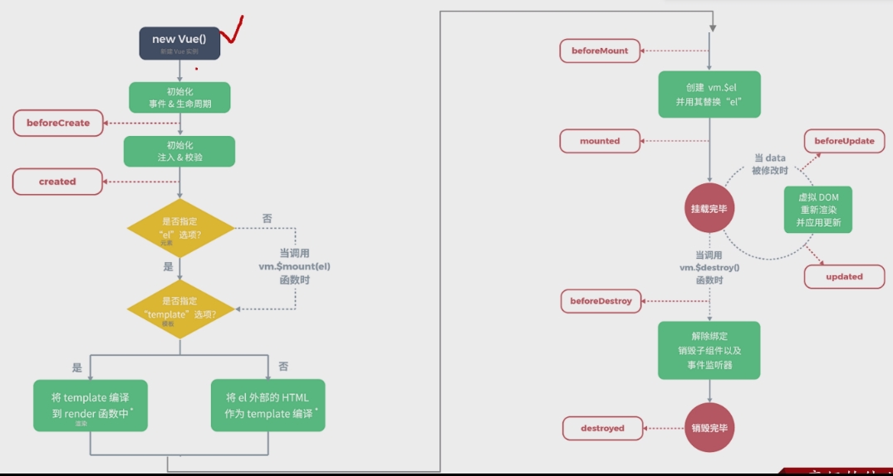
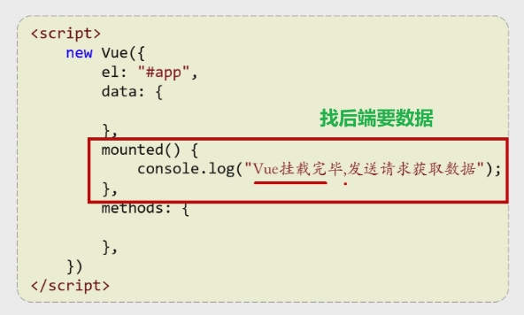

## 概述

> - 尤雨溪在创建 Vue 时，目标是提供一个能够简化 Web 开发的工具，同时保留与其他框架的兼容性。
> - Vue.js 是一个渐进式的 JavaScript 框架，主要用于构建用户界面。
> - 2020 年，Vue 3.0 发布，采用了基于 Proxy 的响应式系统，并引入了组合式 API。


## 优势

> - 响应式数据绑定
>   - 数据和视图之间的同步变得高效，数据变化，视图自动变化
>     - 这意味着开发者不需要手动更新 DOM，从而极大地提高了开发效率和用户体验。
>     - 为什么？
> - 渐进式 
>   - 开发者可以逐步将其引入到现有项目中，而不必完全重写，这使得 Vue 更易于接受和使用
>   - 清晰的结构和组件化开发的形式
>     - 主要用于构建用户界面。
>     - 它的设计理念是将视图与业务逻辑分离，让开发者可以更清晰地关注 UI 的构建。


## 简化Dom示例

> - 假设我们有一个按钮和一个显示计数的文本。我们希望点击按钮时，计数器增加。

### HTMl

```html
<div>
  <p id="counter">0</p>
  <button id="incrementButton">增加</button>
</div>
```

### JS

```javascript
let count = 0;

document.getElementById('incrementButton').addEventListener('click', function() {
  count++;
  document.getElementById('counter').innerText = count;
});
```


> - 每次点击按钮时，我们都需要手动更新 DOM 元素的内容。
> - 我们首先获取按钮和计数器的引用，然后在点击事件中更新计数值并重新设置文本。

****

### HTML

```html
<div id="app">
  <p>{{ count }}</p>
  <button @click="increment">增加</button>
</div>
```

### Vue.js

```javascript
new Vue({
  el: '#app',
  data: {
    count: 0
  },
  methods: {
    increment() {
      this.count++;
    }
  }
});
```


****

### 对比

> - **数据绑定**：
>   - **传统 DOM**：需要手动获取 DOM 元素并更新内容。
>   - **Vue.js**：使用数据绑定（`{{ count }}`），Vue 会自动更新视图。
> - **事件处理**：
>   - **传统 DOM**：使用 `addEventListener` 手动添加事件监听。
>   - **Vue.js**：通过 `@click` 语法简化事件绑定。
> - **代码简洁性**：
>   - **传统 DOM**：需要更多的代码来管理状态和更新视图。
>   - **Vue.js**：代码更清晰，逻辑更加集中，易于维护


## 手动更新与自动更新的理解

### 手动

> - 当数据变化时，你需要显式地去获取元素并更改其内容，也就是所谓的手动

### 自动

> - 在 Vue.js 中，当你改变 `data` 中的变量（例如 `count`），Vue 会自动检测到这个变化，并重新渲染视图。
> - 这就是所谓的“数据绑定”，无需再次获取挂载点，这就是自动。


## MVVM

### 概述

> - M -- Model -- 数据模型
>
>   - 表示应用程序的  **核心数据和业务逻辑**。
>
>   - 负责  **数据的获取和处理，通常与后端进行交互**。
>
>     - 数据获取的方向通常是从服务器、数据库或本地缓存中获取数据。
>
>   - 通常  **包含数据验证、计算等逻辑。**
>
>     
>
> - V -- View -- 视图
>
>   - 表示用户界面（UI），即  **用户看到和交互的部分**。
>
>   - 负责  **显示数据和  捕获用户输入**。
>
>     - 数据获取的方向是用户输入
>
>   - 通常是 HTML、CSS 和图形元素的组合
>
>     
>
> - VM -- View Model -- 视图模型
>
>   - 充当 Model 和 View 之间的  **桥梁**。
>   - 负责将 Model 中的数据转换为 View 可用的格式，同时处理 View 的用户输入，并更新 Model。
>   - 通常包含数据绑定的逻辑，使得当 Model 数据变化时，View 自动更新。

### Vue的MVVM

> - **Model**: 
>
>   - Vue 的 `data` 对象属于 Model，它负责应用状态的存储，包含的是与视图渲染相关的数据。只负责数据的存储，而不处理逻辑。
>
>   - 在Vue中，Model是包含在ViewModel中的
>
>     
>
> - **ViewModel**: 
>
>   - Vue 的 ViewModel 是vue实例对象
>
>   - `methods`、`computed`、`watch` 是ViewModel 的具体实现。
>
>     - 负责处理与 View 交互的业务逻辑和数据处理
>     - 通过双向绑定机制将 Model 和 View 连接起来，自动将 Model 中的数据反映到 View 上
>
>     
>
> - **View**:
>
>   -  Vue 的 `template` 负责声明式的 DOM 结构，这部分是 View，它响应于 Model 中的数据变化而自动更新。

****

### 优点

> - **分离关注点**：MVVM 将用户界面与业务逻辑分开，使得每个部分都能独立开发和测试。
> - **双向数据绑定**：在 Vue.js 和其他 MVVM 框架中，**View 和 ViewModel 之间的双向数据绑定**  确保了数据的实时同步

****

### 简单示例

#### Html

```html
<div id="app">
  <input v-model="message" />
  <p>{{ message }}</p>
</div>
```

#### JS

```javascript
new Vue({
  el: '#app',           // View
  data: {               // Model
    message: null
  },
  methods: {            // ViewModel
    fleshMessage() {
      axios.get('/api/user')
        .then(response => {
          this.message = response.data;  // 更新 Model
        });
    }
  }
});
```

#### MVVM对应

> - **Model** 是 data对象，包含了我们需要展示的数据。
> - **View** 是 HTML 结构，用户可以在其中输入内容。
> - **ViewModel** 是 Vue 实例，处理数据的绑定和更新。


## Vue使用流程

### Html方式

#### 引入框架

```html
<script src="https://unpkg.com/vue@next"></script>
```

#### 创建核心对象

> - 使用 `createApp` 方法，这是 Vue 3 中的主要变更之一

```javascript
const app = Vue.createApp({
    // 选项
});
```

#### 编写视图

> - 可以使用 `<template>` 标签来定义 HTML 结构
> - 并使用 Vue 的指令（如 `v-bind`, `v-model`, `v-for`, 等）来实现动态数据绑定和事件处理

```html
<div id="app">
    <h1>{{ message }}</h1>
    <input v-model="message" />
</div>
```

#### 双向绑定

```javascript
app.mount('#app');
```


****

### ==组件化方式==

#### 创建Vue项目

> - 使用 Vue CLI 创建一个新的 Vue 项目，可以使用命令  vue create my-project

#### 创建组件

> - 在 `src/components` 目录下创建一个新的 Vue 组件文件，通常以 `.vue` 作为扩展名，例如 `MyComponent.vue`。

```vue
<template>
  <div>
    <h1>{{ title }}</h1>
  </div>
</template>

<script>
export default {
  data() {
    return {
      title: 'Hello, Component!'
    };
  }
};
</script>

<style scoped>
h1 {
  color: blue;
}
</style>

```

#### 双向绑定和数据流

> - 在组件中使用 `v-model` 进行双向绑定，实现数据与视图的同步。

#### 处理事件和逻辑

> - 在组件中使用 `methods`、`computed` 和 `watch` 来处理业务逻辑和数据变化。

#### 注册组件

> - 在父组件（通常是 `App.vue`）中导入并注册新创建的组件。

```vue
<template>
  <div id="app">
    <MyComponent />
  </div>
</template>

<script>
import MyComponent from './components/MyComponent.vue';

export default {
  components: {
    MyComponent
  }
};
</script>

```

#### 运行项目

> - 使用 `npm run serve` 启动开发服务器，访问 `http://localhost:8080` 查看效果。


## 两种完整实例对比

### 直接在Html中

> - **直接在 HTML 中**: 所有代码在一个文件中，适合小型示例或快速测试，但不够模块化。
> - **缺乏样式封装**: 所有样式可能影响全局，管理较为困难。
> - **不易维护**: 代码结构简单，随着应用复杂度增加，可能导致难以管理。

```html
<!DOCTYPE html>
<html lang="en">
<head>
    <meta charset="UTF-8">
    <meta name="viewport" content="width=device-width, initial-scale=1.0">
    <title>Vue 3 Example</title>
</head>
<body>
    <div id="app">
        <h1>{{ message }}</h1>
        <input v-model="message" />
    </div>
    
    <script src="https://unpkg.com/vue@next"></script>
    <script>
        const app = Vue.createApp({
            data() {
                return {
                    message: 'Hello, Vue 3!'
                };
            }
        });
        app.mount('#app');
    </script>
</body>
</html>
```


### 组件化

> - **组件化**: 使用 Vue 的单文件组件结构，这使得代码更模块化和可重用。
> - **样式作用域**: `style` 标签中的 `scoped` 属性确保样式只应用于当前组件，不影响全局样式。
> - **可维护性**: 代码清晰分隔为模板、逻辑和样式，便于管理。

```vue
<template>
  <div>
    <h1>{{ message }}</h1>
    <input v-model="message" />
  </div>
</template>

<script>
export default {
  data() {
    return {
      message: 'Hello, Vue 3!'
    };
  }
};
</script>

<style scoped>
h1 {
  color: blue;
}
</style>
```


### 使用场景对比

> - **单文件组件**更适合于大型项目，特别是当您需要将多个组件组合在一起时。它们在 Vue CLI 创建的项目中使用，通常与模块打包工具（如 Webpack）配合使用。
> - **HTML 文件**适合快速原型开发和小型项目或示例，尤其是在没有构建工具时。

### 总结

> - 单文件组件（SFC）更符合现代前端开发的最佳实践，提供了更好的可维护性、模块化和样式封装。适合大型项目。
> - HTML 文件适合简单示例和快速原型开发，但对于复杂应用来说可能不够灵活。


## 常用指令

### 数据绑定指令

#### **v-bind**

> - 动态绑定 HTML标签的 属性值，如 `href`、`src`、css 样式等。
> - 可使用 `v-bind` 将 Vue 实例中的数据与 HTML 元素的属性连接起来。

```html
<a v-bind:href="url">链接</a>
<div v-bind:style="{ color: textColor }">文本</div>
<div v-bind:class="{ active: isActive }"></div>
```

> - **href**：动态绑定链接地址。
> - **style**：动态绑定内联样式。
>   - 可以绑定多个样式属性，例如颜色、字体等。
> - **class**：动态绑定 css 类

#### **v-model**

> - 用于在 表单控件 和  Vue 实例 的数据之间创建  ==**双向数据绑定**。==
> - 简化了表单元素的值与 Vue 数据的同步。

```html
<input v-model="message" placeholder="输入内容">
<select v-model="selected">
  <option v-for="option in options" :value="option">{{ option }}</option>
</select>
```

> - 这里的 `input` 和 `select` 元素的值会自动与 Vue 实例中的 `message` 和 `selected` 变量保持同步。
> - **双向绑定**：当用户在输入框中输入内容时，Vue 实例中的数据也会自动更新，反之亦然。
> - 适用于各种表单控件，包括输入框、复选框、单选按钮等。

#### :model

> -  < t-form ref="form" :model="searchData"  >
>   - 表示将 `searchData` 对象绑定到 `<t-form>` 组件的 `model` 属性上。
>   - 这个语法是 Vue 的简写，`:model` 等同于 `v-bind:model`。
> - 与 `v-model` 不同的是，`v-model` 通常用于表单输入元素，用于实现双向绑定。
> - 而 `:model` 是 **==单向数据绑定==** ，将 `searchData` 的值传递给组件，但不一定会直接修改 `searchData`。

```vue
<t-form ref="form" :model="searchData" label-width="98">
    <t-row>
        <t-col>
            <t-form-item label="护理项目名称：" name="name">
                <t-input placeholder="请输入内容" v-model="searchData.name" class="form-item-content" type="search"
                         clearable @clear="handleClear('name')" />
            </t-form-item>
        </t-col>
    </t-row>
</t-form>
```


### 条件渲染指令

#### **v-if**

> - 用于条件渲染，根据表达式的真假值决定是否渲染该元素

```html
<p v-if="isVisible">这是可见的文本。</p>
```

#### **v-else**

> - 与  v-if  配合使用，表示条件不成立时的渲染。

```html
<p v-if="isVisible">这是可见的文本。</p>
<p v-else>这是不可见的文本。</p>
```

#### **v-else-if**

> - 用于在多个条件之间进行判断。

```html
<p v-if="type === 'A'">类型 A</p>
<p v-else-if="type === 'B'">类型 B</p>
<p v-else>其他类型</p>
```

#### **v-show**

> - 用于根据条件控制元素的显示或隐藏
> - 与 `v-if` 不同的是，它不移除元素，仅仅是通过 CSS 设置 `display` 属性。
> - 全部渲染，通过控制display来确定是否显示

```html
<p v-show="isVisible">这个文本可能会被隐藏。</p>
```

### 列表渲染指令

#### **v-for**

> - 用于循环渲染数组或对象中的数据
> - 遍历数组或对象，渲染对应的元素

```html
<ul>
  <li v-for="item in items" :key="item.id">{{ item.name }}</li>
</ul>
```

### 事件处理指令

#### v-on

> - 用于绑定用户的事件，例如点击、输入等。
> - 用于在 HTML 元素上绑定事件监听器。

```html
<button v-on:click="handleClick">点击我</button>
```

> - 当按钮被点击时，将调用 `handleClick` 方法。

> - 常见用法
>   - 处理鼠标事件（如 `click`、`mouseover`）
>   - 处理键盘事件（如 `keydown`、`keyup`）
>   - 处理表单事件（如 `submit`）

### 插槽和组件相关指令

#### *v-slot*

> - 用于处理组件间的内容传递和插槽
> - 定义具名插槽，允许父组件向子组件传递内容

```html
<template v-slot:header>
  <h1>标题</h1>
</template>
```


## 生命周期



> - 每触发一个生命周期事件，会自动执行一个生命周期方法（钩子）

### mounted




## 组件库选择

> - **Vue 2.x 与 Element UI**：
>   - Element UI 是一个为 Vue 2.x 设计的组件库，提供了一系列优雅且实用的 UI 组件，适合中后台应用的开发。由于其设计和功能，Element UI 与 Vue 2.x 的结合非常流行，广泛用于企业级应用和管理系统中。
> - **Vue 3.x 与 TDesign**：
>   - TDesign 是一款面向 Vue 3.x 的组件库，提供了丰富的 UI 组件，旨在提升用户体验和开发效率。TDesign 是一个相对较新的库，结合了 Vue 3.x 的新特性（如 Composition API），使得它在构建现代 Web 应用时更加灵活和强大。


> - ### Element Plus
>
>   - **设计理念**：Element Plus 是 Element UI 的 Vue 3 版本，专注于快速开发和易用性。它提供了一套丰富的组件，适合中大型应用开发。
>   - **社区和文档**：Element Plus 拥有活跃的社区和丰富的文档，便于开发者查阅和学习。
>   - **组件丰富性**：包括表单、按钮、弹窗等多种常用组件，适合大多数业务场景。
>
> - ### TDesign
>
>   - **设计理念**：TDesign 是腾讯推出的设计系统，强调企业级应用的 UI 组件库，提供了一套完整的设计规范。
>   - **定制化能力**：支持主题定制和企业内部设计规范的实现，适合需要较高定制化的项目。
>   - **跨平台支持**：除了 Vue 3 之外，TDesign 还支持其他框架如 React 和小程序，适合多技术栈团队。
>
> - ### 适用场景
>
>   - **Element Plus** 更适合快速开发和较为通用的应用场景，尤其是希望使用一个成熟的、社区支持良好的组件库的项目。
>   - **TDesign** 则更适合需要高定制化、企业级设计需求的项目，特别是在大型团队和复杂项目中。