## 概览

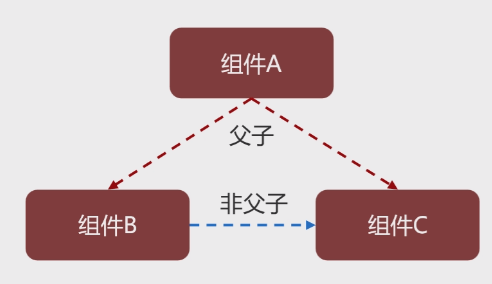

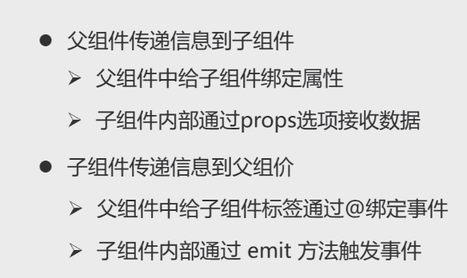

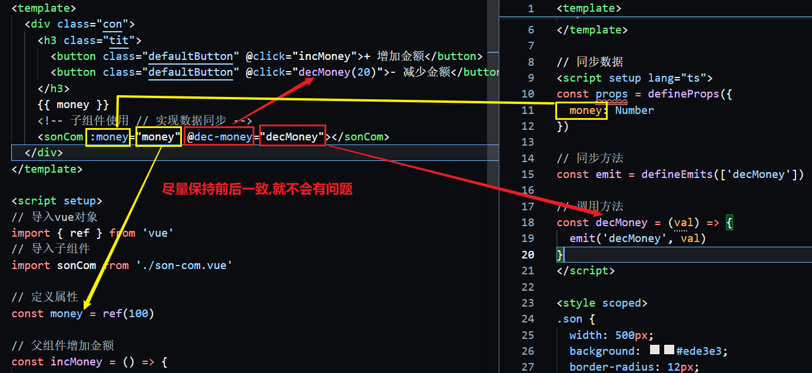

### 传变量

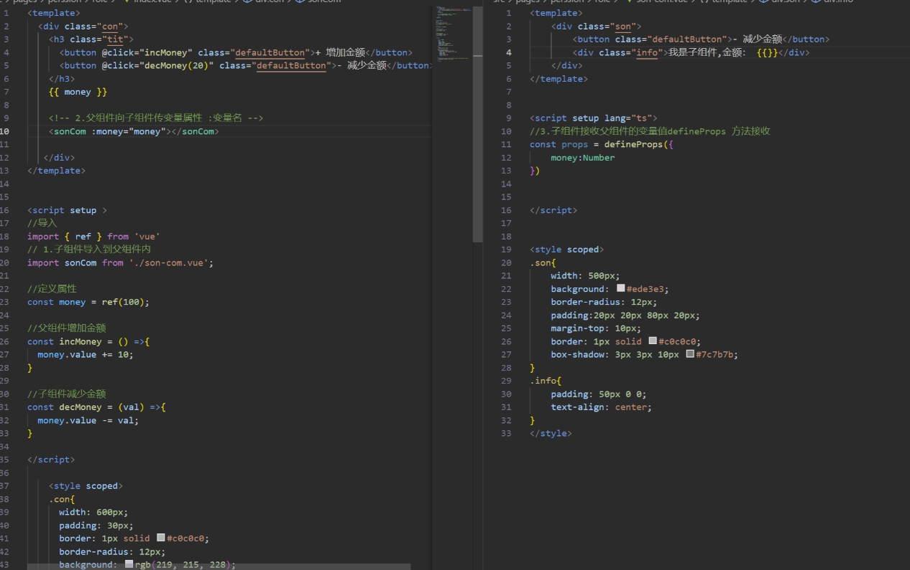

#### 子组件导入父组件

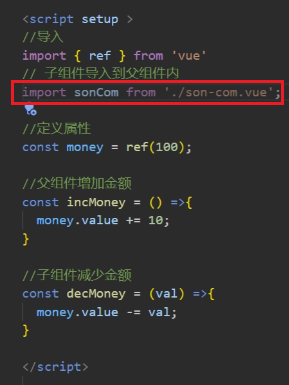

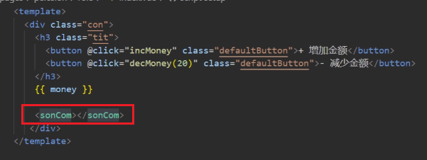

#### 父子数据同步

> - 父组件向子组件传变量属性 空格:变量名

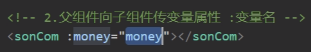

> - 子组件接收父组件数据
>   - defineProps({
>
>  })


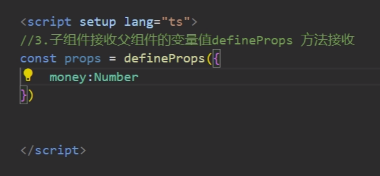

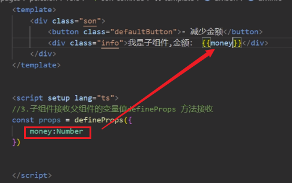


### 传方法

#### 父组件向子组件传方法@方法名

> - 最好保持一致

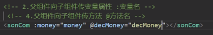

#### 子组接收父组件方法

> - `defineEmits ([ 'onPageChange' ])`
>   - 数组--方法名称

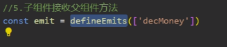


#### 调用子组件方法

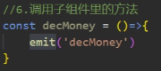

#### 传参

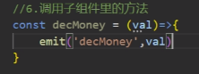

#### 增加事件监听

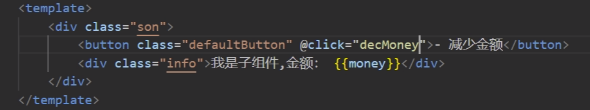

## 完整代码

### index.vue

```vue
<template>
  <div class="con">
    <h3 class="tit">
      <button class="defaultButton" @click="incMoney">+ 增加金额</button>
      <button class="defaultButton" @click="decMoney(20)">- 减少金额</button>
    </h3>
    {{ money }}
  </div>

  <!-- 子组件使用 // 实现数据同步 -->
  <sonCom :money="money" @decMoney="decMoney"></sonCom>
</template>

<script setup>
// 导入vue对象
import { ref } from 'vue'
// 导入子组件
import sonCom from './son-com.vue'

// 定义属性
const money = ref(100)

// 父组件增加金额
const incMoney = () => {
  money.value += 10
}

// 子组件减少金额
const decMoney = (val) => {
  money.value -= val
}
</script>

<style scoped>
.con {
  width: 600px;
  padding: 30px;
  border: 1px solid #c0c0c0;
  border-radius: 12px;
  background: rgb(219, 215, 228);
}
.tit {
  padding-bottom: 10px;
}
:deep(.defaultButton) {
  background: rgb(237, 241, 251);
  border: 1px solid rgb(207, 195, 250);
  width: 80px;
  height: 30px;
  border-radius: 4px;
  cursor: pointer;
}
.defaultButton:active,
.defaultButton:visited,
.defaultButton:focus {
  background: rgb(237, 241, 251);
}
</style>

```

### son-com.vue

```vue
<template>
  <div class="son">
    <button class="defaultButton" @click="decMoney(10)">- 减少金额</button>
    <div class="info">我是子组件,金额：{{ money }}</div>
  </div>
</template>

// 同步数据
<script setup lang="ts">
const props = defineProps({
  money: Number
})

// 同步方法
const emit = defineEmits(['decMoney'])

// 调用方法
const decMoney = (val) => {
  emit('decMoney', val)
}
</script>

<style scoped>
.son {
  width: 500px;
  background: #ede3e3;
  border-radius: 12px;
  padding: 20px 20px 80px 20px;
  margin-top: 10px;
  border: 1px solid #c0c0c0;
  box-shadow: 3px 3px 10px #7c7b7b;
}
.info {
  padding: 50px 0 0;
  text-align: center;
}
</style>

```